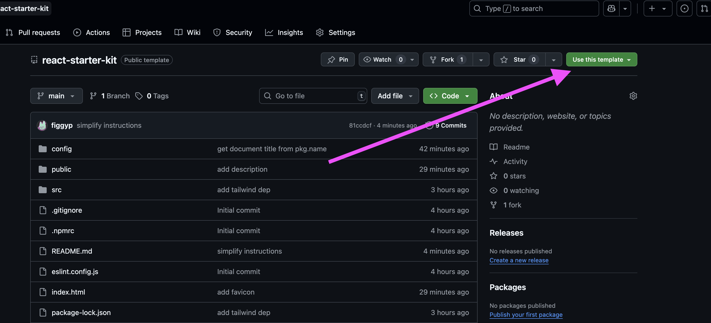
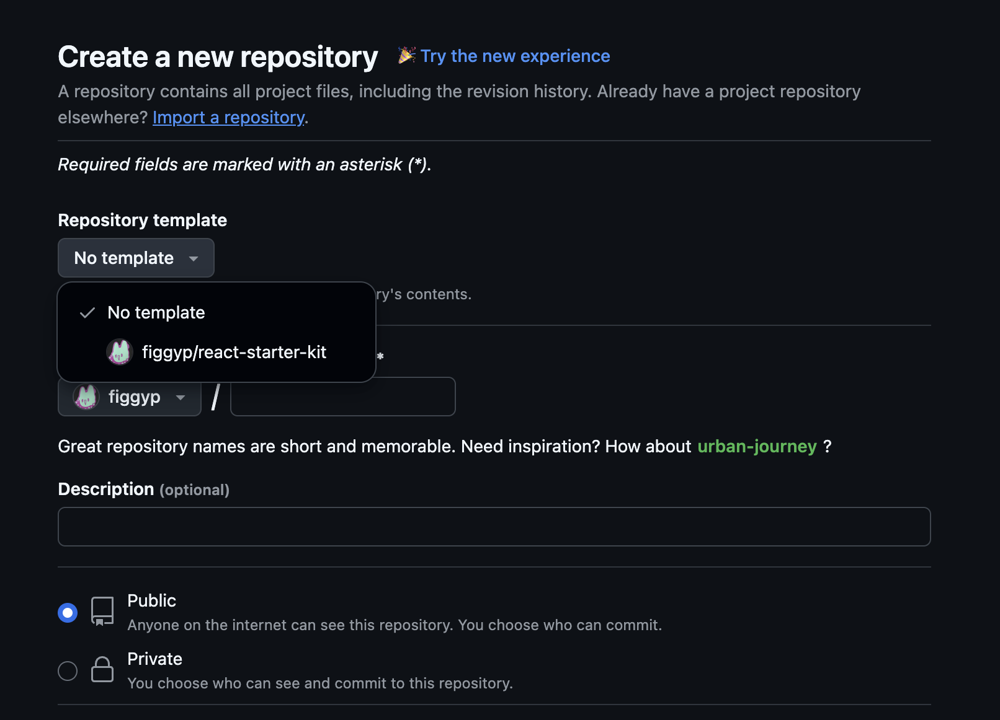

# React Starter Kit

Boilerplate repo for React SPA applications

## Instructions

This repo is intended to be consumed as a [Template repository](https://docs.github.com/en/repositories/creating-and-managing-repositories/creating-a-template-repository#about-template-repositories). There are three (3) options:

### Option 1
Click the "Use this template" button at the top of https://github.com/figgyp/react-starter-kit.



### Option 2

Fork the repo `figgyp/react-starter-kit`, and reference the newly created fork on https://github.com/new



### Option 3

Use the [GitHub CLI](https://github.com/cli/cli) to create a new repo from the command line.

This option requires you to have installed the GH CLI client (`brew install gh`) and authenticated it with your github account.

```sh
 gh repo create foobar --template figgyp/react-starter-kit --clone --public
 ✓ Created repository figgyp/foobar on github.com
  https://github.com/figgyp/foobar
```
